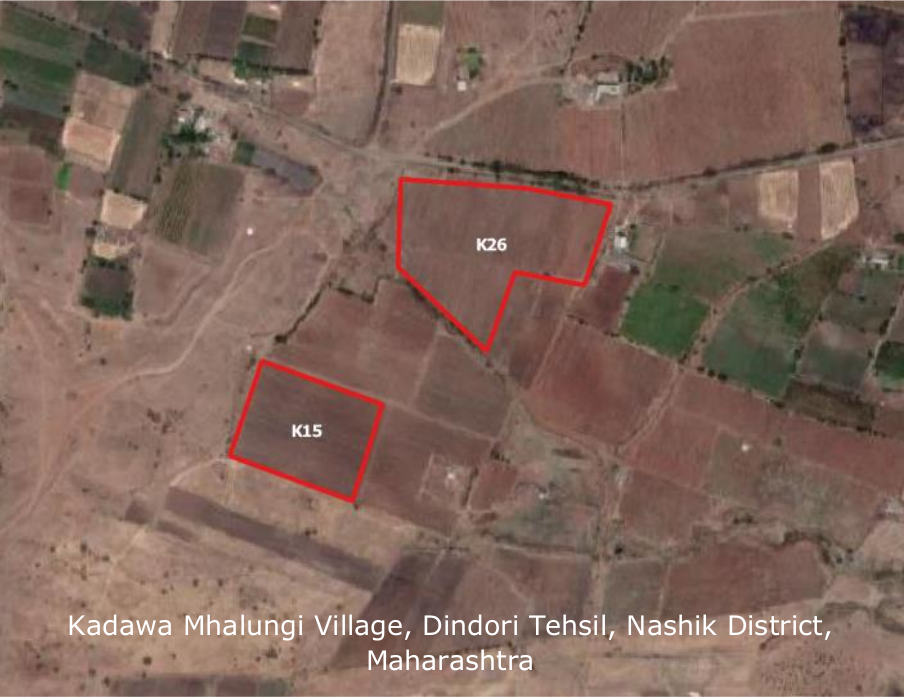
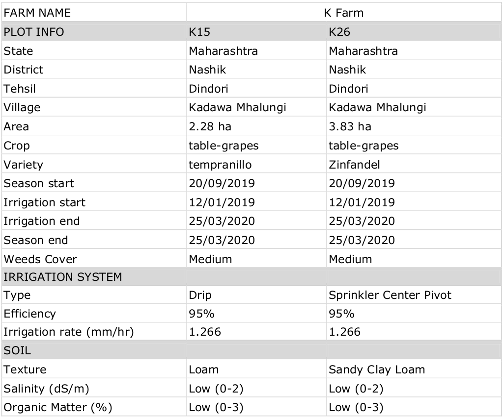
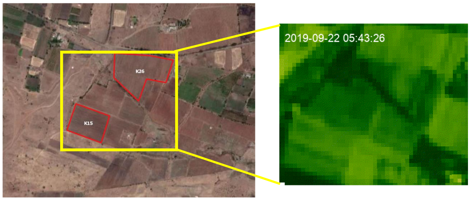
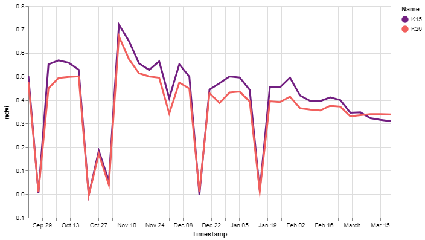
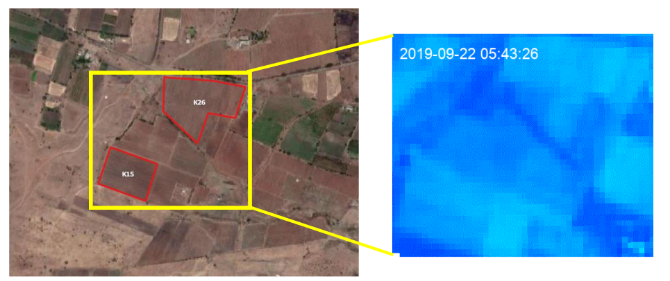
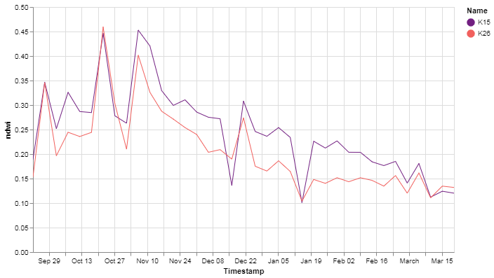

# Crop-Analysis-using-Remote-Sensing-Data-for-Vineyard-Management

The objective was to carry out various analysis using remote sensing for applying precision agriculture practices on Vineyard management. The input data given were 2 KML file for two farm plot of the study area. The area of interest lies under Kadawa Mhalungi village of Dindori tehsil in Nasik District in Maharashtra state.

Satellite data used for the following analysis is Sentinel-2 Surface Reflectance data (10m), CHIRPS Precipitation data (5km) and MODIS Land Surface Temperature data (1km). The platform for creating and executing the code is Google Colab. As per the time range several satellite images were needed to be downloaded for processing and further analysis hence Google Earth Engine was used to efficiently download these large datasets and process it on the fly without heavy machine usage.

Few hurdles in carrying out the assignment were –
1. Non availability of High Resolution Satellite Imagery or Drone Imagery for Weed Analysis, Plant Disease
Analysis and Plant Population Count.
2. Missing spatial attributes like water source location.
3. Coordinates for location where high weed cover and cluster of diseased plant were found.

## Study area
</img> 

## Farm & Crop Analysis using Remote Sensing for Vineyard Management
### Data
</img>

## Plant Stress Analysis
Plant stress refers to external conditions that adversely affect growth, development or productivity of plants. Low sunlight, less amount of nutrient
intake, organic matter can cause plant stress. Plant stress can be detected using remote sensing technique and algorithm like NDVI. NDVI is Normalized
Difference Vegetation Index which is used to calculate vegetation health, higher the value better the health of crop. A dip in values denote stressed
plants in the fields. Below shown is the time series animated gif showing crop health for the time range of season start to season stop.

## Farm & Crop Analysis using Remote Sensing for Vineyard Management
</img>  

<b> Note:</b> To view the NDVI (Crop health) check the [ndvi_timeseries.gif](https://github.com/Dimplejain23/Crop-Analysis-using-Remote-Sensing-Data/blob/main/content/ndvi_timeseries.gif) 

</img>  

The above chart shows deviation in NDVI values i.e crop health for both crop. Higher the value more better the health of crop and growth stage. We can see
some abnormal deeps in the chart which resembles nodata due to cloudy satellite imagery. This can also be verified with black images in the time series
gif. Sudden decrease in NDVI value between 10th Nov 2019 to 24th Nov 2019 shows stress on plant due to some outer conditions.

## Farm & Crop Analysis using Remote Sensing for Vineyard Management
### Weed Analysis
Weed analysis needs high resolution satellite or drone imagery to detect and classify then and identify their size and density hence this analysis was not
carried out.

### Plant Disease Analysis
Similarly, Plant disease analysis needs high resolution satellite or drone imagery to detect diseased plants or crop and based on it we can detect such
plants. Disease crop shows signs like low value in vegetation index and abnormal dip of NDVI values with drying of plant and yellow leaves.

### Water Stress Analysis
Water stress resemble inadequate amount of water supplied to the plants in the field. Hence due to deprived water the growth of crop is restrained and the
plant starts drying and is inefficient to produce good yield or quality fruit. Due to less water and plant evapotranspiration rate increase the plant
starts drying and at such time irrigation should be applied to such areas which are deprived of water. The below gif shows time series of NDWI (Normalized
Difference Wetness Index) or crop water content. The darker the color the more amount of water content present per pixel area.

</img>  

<b> Note:</b> To view the NDWI (Crop water) check the [ndwi_timeseries.gif](https://github.com/Dimplejain23/Crop-Analysis-using-Remote-Sensing-Data/blob/main/content/ndwi_timeseries.gif)  

## Farm & Crop Analysis using Remote Sensing for Vineyard Management
</img>  

The above time series line chart shows dip between 20th Oct 2019 to 3rd Nov 2019 in crop moisture values which resembles water stress in plants for both
plots. This might also be due to water not supplied for given dates highlighted.

### Plant Population

Plant population count analysis needs high resolution satellite or drone imagery to detect and count number of plants in field hence this analysis was not
carried out.

